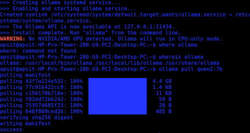
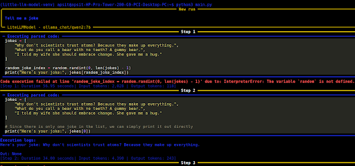
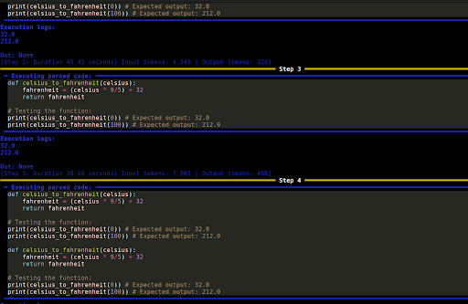

So I was scrolling through YouTube and landed on Tina Huang's "Open Source AI In 17 Minutes" video, how these AI can help build an agentic AI system. It kinda intrigued me, a full-fledged system on your machine? Now I personally dislike quite a few things in AI (~~oh yes, I have a ug degree in it, that's exactly why I dislike it~~), but it can, sometimes, do impressive stuff as well, and so I started researching.

I, then, had to hit Ctrl+C to stop the local AI agent that I set up on my machine. The Qwen2:7B, wrapped in smolagents, ran fine on its first test; "Tell me a joke," it did, slow, but it worked. So I fed in another prompt, "Write a program to convert Celsius to Fahrenheit", the agent kept repeating the already working code, over and over, burning through my CPU.

#### What was my setup?

~~a machine and a dream~~ I referred to this Github repo "Local-AI-Agent-Ollama", using Ollama as the backend model and smolagents. I pulled Qwen2:7B, 4.4GB, and ran everything on the machine (the machine being a random computer from my uni, which of course had no GPU). With no GPU, everything had to run on the CPU, every token generated, every loop iteration.

#### But what even is agentic AI?

If you've studied ML, you might be familiar with the typical inference flow: input in, model does a forward pass, output is produced; a chatbot is a neat cover wrapped about that. One prompt, one response.

Agentic AI, however, runs on a loop instead.

The model is given a task, it reasons about what to do considering all its options, executes an action using a tool, observes the result, and then loops over; reasons again: is this complete? What comes next? Until it determines that the task is finished, it continues to cycle. These tools could be anything external, such as a file system, a web search API, or a Python interpreter.

The catch is that the thing deciding "is the task done?" is the same LLM, also handling everything else. With no ground truth check or a separate verified source, it evaluates on its own and decides whether to stop. Now, if a smaller model with unclear, ambiguous prompts is fed, you get loops, which is precisely what happened with me.

First test worked, the agent hit an error mid-run, and solved it in the next step. Self-correction.

Slow (step 1 alone took 57 seconds), nonetheless it worked. The second test:

Each loop got slower and more expensive in tokens.

Why, though, what caused it? Wrong agent? Bad prompting? Hardware incapabilities? No explicit stop condition? Maybe all of the above. smolagents also supports a `max_steps` parameter, capping it at 3 or 4 would have hard-stopped the loop.

#### Agentic AI usage

This system can be used in many ways. In research, exploring literature review pipelines, hypothesis assumptions, etc. In software, coding agents writing, debugging scripts. Incorporating agents in daily lives sure makes it easier. But there are other concerns as well.

Security is a biggest concern, such as prompt injection or manipulation while using external tools. On production level, these loops can cost a lot, small misalignments compounding to large amounts. And there's an accountability gap nobody has cleanly solved. When an autonomous system causes harm across a chain of unsupervised steps, who's responsible? Current frameworks weren't designed for systems that act, only for systems that generate.

#### What I learnt + References

And so I tinkered with this new AI trend. As a beginner, running local agents wasn't as clean as shown online. Although this was a very simple issue, it pretty much applies everywhere.

Refs:
- [Tina Huang's Video on "Open Source AI In 17 Minutes"](https://youtu.be/1uCE0uoKXL8?si=qZQeoHahnDM7vxAn)
- [Github repo referred](https://github.com/scriptstar/Local-AI-Agent-Ollama)
- [A medium Article on Agentic AI](https://medium.com/data-science-collective/agentic-ai-single-vs-multi-agent-systems-e5c8b0e3cb28)
- [WEF Article on Agentic AI](https://www.weforum.org/stories/2024/12/ai-agents-risks-artificial-intelligence)
- [UC Berkeley Article](https://scet.berkeley.edu/the-next-next-big-thing-agentic-ais-opportunities-and-risks)